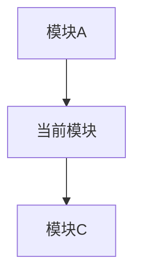

# Plan 模式详细设计文档

**版本**: 1.0
**日期**: 2026-02-20
**目标**: 定义分层 TDD 开发范式的 Plan 模式

---

## 1. 模式定位

### 1.1 新模式架构

```
┌─────────────────────────────────────────────────────────────────┐
│                        Morty 2.0 架构                            │
├─────────────────────────────────────────────────────────────────┤
│                                                                   │
│  ┌──────────────┐    ┌──────────────┐    ┌──────────────┐       │
│  │   research   │───→│     plan     │───→│    doing     │       │
│  │   (调研)     │    │   (规划)     │    │   (执行)     │       │
│  └──────────────┘    └──────────────┘    └──────────────┘       │
│         │                   │                   │                │
│         ▼                   ▼                   ▼                │
│    .morty/research/    .morty/plan/        .morty/doing/        │
│    [主题].md           [模块].md           logs/               │
│                        [生产测试].md       status.json         │
│                                                                   │
└─────────────────────────────────────────────────────────────────┘
```

### 1.2 Plan 模式的核心职责

Plan 模式是连接 Research（知识）和 Doing（执行）的桥梁，负责：

1. **消化事实**: 读取 research 的研究结果作为事实性信息
2. **架构设计**: 将系统拆解为功能模块
3. **任务规划**: 每个模块拆解为多个 Job（Loop 块）
4. **TDD 设计**: 为每个 Job 定义验证器（验收标准）
5. **测试先行**: 先生成单元测试，再驱动开发
6. **分层验证**: 单元测试 → 集成测试 → 端到端测试

---

## 2. 输出结构 (.morty/plan/)

```
.morty/
├── research/               # Research 模式输出（输入源）
│   └── [调查主题].md
│
├── plan/                   # Plan 模式输出
│   ├── README.md           # Plan 总览，索引所有模块
│   ├── [模块A].md          # 功能模块 A 的详细计划
│   ├── [模块B].md          # 功能模块 B 的详细计划
│   └── [生产测试].md       # 端到端测试与部署计划
│
└── doing/                  # Doing 模式工作目录（运行时生成）
    ├── logs/               # 执行日志
    ├── status.json         # 当前状态
    └── current_job.json    # 当前执行的 Job
```

---

## 3. 功能模块 Plan 文件规范

### 3.1 文件结构 ([模块名].md)

```markdown
# Plan: [模块名称]

## 模块概述

**依赖模块**: [模块A], [模块B]
**被依赖模块**: [模块C]
**对应 Research**: [相关研究发现，链接到 .morty/research/]

## 架构设计

### 接口定义
[模块对外暴露的接口/API]

### 数据模型
[核心数据结构]

### 依赖关系


## Jobs (Loop 块列表)

---

### Job 1: [Job 名称]

**目标**: [这个 Job 要完成什么]

**前置条件**:
- [依赖的 Job 完成]
- [环境准备]

**Tasks (Todo List)**:
- [ ] Task 1: [具体任务]
- [ ] Task 2: [具体任务]
- [ ] Task 3: [具体任务]

**验证器 (Validator)**:
```yaml
validator:
  type: unit_test
  description: "这个 Job 完成的验收标准"
  test_cases:
    - name: "测试用例1"
      input: [输入]
      expected: [期望输出]
      assertion: [断言类型: equal/contain/throw等]
    - name: "测试用例2"
      input: [输入]
      expected: [期望输出]
  coverage:
    min_percentage: 80
  metrics:
    - execution_time < 100ms
    - memory_usage < 10MB
```

**单元测试脚本**:
```python
# tests/unit/test_[module]_[job].py
# 由 Plan 模式自动生成
import unittest

class Test[Module][Job](unittest.TestCase):
    def test_case_1(self):
        # 根据验证器生成
        pass
```

**回滚策略**:
- 失败重试次数: 3
- 失败后动作: [修复/跳过/终止]

---

### Job 2: [Job 名称]

[同上结构]

---

## 集成测试

**触发条件**: 所有 Jobs 完成

**验证器**:
```yaml
validator:
  type: integration_test
  description: "模块级集成测试"
  test_cases:
    - name: "完整工作流测试"
      steps:
        - step1
        - step2
      expected: [期望结果]
  dependencies:
    - [需要 mock 的外部依赖]
```

**集成测试脚本**:
```python
# tests/integration/test_[module]_integration.py
```

**集成测试通过标准**:
- 所有测试用例通过
- 代码覆盖率 ≥ 80%
- 无内存泄漏
- 性能指标达标
```

### 3.2 Job 状态机

每个 Job 有自己的生命周期：

```
[PENDING] → [RUNNING] → [TEST_GENERATED]
                            ↓
[BLOCKED] ← [FAILED] ← [TEST_FAILED]
   ↑           ↓
   └────── [RETRYING]
                ↓
          [TEST_PASSED] → [COMPLETED]
```

**状态说明**:
- `PENDING`: 等待前置条件
- `RUNNING`: Doing 模式正在执行
- `TEST_GENERATED`: 已根据验证器生成测试
- `TEST_FAILED`: 单元测试未通过，需要根据报错修复
- `RETRYING`: 重试中（有重试次数限制）
- `TEST_PASSED`: 单元测试通过
- `COMPLETED`: Job 完成
- `BLOCKED`: 被阻塞（前置条件不满足或重试耗尽）

---

## 4. 生产测试文件规范 ([生产测试].md)

### 4.1 特殊定位

这是一个特殊的 Plan 文件，不对应功能模块，而是对应**整个项目的端到端测试**。

### 4.2 文件结构

```markdown
# Plan: [生产测试]

## 部署架构

### 目标环境
- **开发环境**: [描述]
- **生产环境**: [描述]
- **环境同构策略**:
  - 容器化: [Dockerfile / 容器镜像]
  - 配置管理: [环境变量 / 配置中心]
  - 依赖版本锁定: [lockfile 策略]

### 部署流程
```yaml
deployment:
  steps:
    - name: "构建"
      command: [构建命令]
    - name: "测试"
      command: [测试命令]
    - name: "打包"
      command: [打包命令]
    - name: "部署"
      command: [部署命令]
```

### 环境一致性保障
- [ ] Docker 镜像统一开发/生产环境
- [ ] docker-compose 定义完整服务栈
- [ ] 环境变量模板 (.env.example)
- [ ] 数据库迁移脚本版本控制
- [ ] 健康检查端点

## Jobs

### Job: 开发环境启动验证

**目标**: 确保 `morty doing` 启动的开发环境等价于生产环境

**Tasks**:
- [ ] 启动开发环境
- [ ] 验证服务健康状态
- [ ] 验证配置加载
- [ ] 验证依赖版本

**验证器**:
```yaml
validator:
  type: environment_check
  description: "开发环境与生产环境一致性检查"
  checks:
    - name: "OS 一致性"
      command: "cat /etc/os-release"
      expected_pattern: "Ubuntu 22.04"
    - name: "依赖版本一致性"
      command: "pip freeze | grep key-dep"
      expected_file: "requirements.lock"
    - name: "配置一致性"
      command: "diff .env.example .env"
      ignore_lines: ["SECRET", "PASSWORD"]
```

---

### Job: 端到端功能测试

**目标**: 完整业务流程验证

**前置条件**: 所有功能模块开发完成

**Tasks**:
- [ ] 部署完整服务栈
- [ ] 执行端到端测试套件
- [ ] 验证关键业务指标
- [ ] 性能基准测试

**验证器**:
```yaml
validator:
  type: e2e_test
  description: "端到端功能性测试"
  test_suite:
    - name: "完整用户旅程"
      scenario: "用户注册 → 登录 → 使用核心功能 → 登出"
      steps:
        - action: "注册"
          api: "POST /api/register"
          validate_response: { status: 201 }
        - action: "登录"
          api: "POST /api/login"
          validate_response: { status: 200, has_token: true }
        # ...
    - name: "故障恢复测试"
      scenario: "服务中断后自动恢复"
      # ...
  success_criteria:
    - all_tests_pass: true
    - success_rate: ">= 99.9%"
    - p95_latency: "< 200ms"
```

**端到端测试脚本**:
```python
# tests/e2e/test_production.py
# 由 Plan 模式自动生成
```

---

## 回滚策略

**自动回滚触发条件**:
- 端到端测试失败率 > 1%
- 关键功能不可用
- 性能指标不达标

**回滚流程**:
1. 停止当前部署
2. 切换到上一个稳定版本
3. 验证回滚成功
4. 通知团队
```

---

## 5. 分层 TDD 流程

### 5.1 三层验证模型

```
┌─────────────────────────────────────────────────────────────┐
│                     Layer 3: 端到端测试                       │
│                    [生产测试].md                             │
│           验证完整业务流程 + 部署正确性                       │
│                      由 doing 模式执行                        │
└─────────────────────────────────────────────────────────────┘
                              ↑
┌─────────────────────────────────────────────────────────────┐
│                    Layer 2: 集成测试                          │
│                   [模块名].md 中的集成测试                     │
│           验证模块内多个 Job 的协同工作                       │
│               所有 Jobs 完成后自动触发                        │
└─────────────────────────────────────────────────────────────┘
                              ↑
┌─────────────────────────────────────────────────────────────┐
│                    Layer 1: 单元测试                          │
│                  [模块名].md 中的每个 Job                     │
│          验证单个 Job 的功能正确性                            │
│           Job 执行前根据验证器生成                            │
└─────────────────────────────────────────────────────────────┘
```

### 5.2 Doing 模式执行流程

```
开始 doing
    ↓
读取 .morty/plan/README.md
    ↓
选择第一个 PENDING 状态的模块
    ↓
选择第一个 PENDING 状态的 Job
    ↓
┌─────────────────────────────┐
│ 阶段 1: 生成单元测试         │
│ - 解析验证器定义            │
│ - 生成测试脚本              │
│ - 更新 Job 状态: TEST_GENERATED│
└─────────────────────────────┘
    ↓
┌─────────────────────────────┐
│ 阶段 2: 执行测试             │
│ - 运行生成的测试            │
│ - 如果通过: TEST_PASSED → COMPLETED│
│ - 如果失败: TEST_FAILED    │
└─────────────────────────────┘
    ↓
测试失败?
    ├── 是 → 分析错误 → 修复代码 → 重新运行测试 (最多 N 次)
    └── 否 → Job 完成，检查下一个 Job
    ↓
所有 Jobs 完成?
    ├── 否 → 下一个 Job
    └── 是 → 运行集成测试
    ↓
集成测试通过?
    ├── 否 → 标记模块失败，可能需要重新设计
    └── 是 → 模块完成
    ↓
所有模块完成?
    ├── 否 → 下一个模块
    └── 是 → 运行 [生产测试]
    ↓
端到端测试通过?
    ├── 否 → 标记需要修复，可能回滚
    └── 是 → 项目完成 🎉
```

---

## 6. Plan 模式实现要点

### 6.1 输入处理

```bash
# Plan 模式启动时
morty plan

# 1. 检查前置条件
if [[ ! -d ".morty/research" ]]; then
    error "请先运行 morty research"
fi

# 2. 读取所有 research 文件作为事实
RESEARCH_FACTS=$(cat .morty/research/*.md)

# 3. 启动交互式 Claude 会话
# 系统提示词包含 Plan 模式规范
# 交互式确认模块划分和 Job 设计
```

### 6.2 提示词设计要点

Plan 模式的系统提示词需要包含：

1. **TDD 原则**: 测试先行，红-绿-重构
2. **验证器语法**: YAML 格式的验证器定义规范
3. **Job 设计原则**: 小而独立，可验证
4. **模块边界**: 高内聚低耦合
5. **环境同构**: 开发即生产

### 6.3 文件生成逻辑

```python
def generate_plan_files(research_content, user_input):
    """生成功能模块 plan 文件"""
    # 1. 解析 research 结果
    facts = parse_research(research_content)

    # 2. 识别功能模块
    modules = identify_modules(facts)

    # 3. 对每个模块生成 Jobs
    for module in modules:
        jobs = design_jobs(module)

        # 4. 为每个 Job 生成验证器
        for job in jobs:
            job.validator = generate_validator(job)
            job.test_template = generate_test_template(job.validator)

        # 5. 生成模块级集成测试验证器
        module.integration_validator = generate_integration_validator(module)

        # 6. 写入 [模块名].md
        write_module_plan(module)

    # 7. 生成 [生产测试].md
    production_plan = generate_production_plan(modules)
    write_production_plan(production_plan)

    # 8. 生成 README.md 索引
    generate_plan_readme(modules)
```

---

## 7. 与 Doing 模式的衔接

### 7.1 Doing 模式输入

Doing 模式读取 `.morty/plan/` 下的文件：

```python
# doing 模式启动时
plan = load_plan(".morty/plan/README.md")

for module in plan.modules:
    if module.status != "COMPLETED":
        for job in module.jobs:
            if job.status == "PENDING":
                execute_job(job)
```

### 7.2 Job 执行详情

```python
def execute_job(job):
    """执行单个 Job"""
    job.status = "RUNNING"

    # 阶段 1: 生成测试
    if job.validator.type == "unit_test":
        test_file = generate_unit_test(job)
        job.status = "TEST_GENERATED"

    # 阶段 2: 执行测试循环
    retry_count = 0
    max_retries = job.rollback_strategy.max_retries

    while retry_count < max_retries:
        result = run_test(test_file)

        if result.success:
            job.status = "COMPLETED"
            return True
        else:
            job.status = "TEST_FAILED"
            # 分析错误，修复代码
            fix = analyze_and_fix(result.errors)
            apply_fix(fix)
            retry_count += 1
            job.status = "RETRYING"

    # 重试耗尽
    job.status = "BLOCKED"
    return False
```

---

## 8. 关键设计决策

### 8.1 为什么用 YAML 定义验证器？

- **结构化**: 易于解析和生成
- **可读性**: 人类可读，便于审查
- **可扩展**: 容易添加新的验证类型

### 8.2 为什么 Job 是 Loop 块？

- **原子性**: 每个 Job 是独立的开发单元
- **可验证**: 明确的完成标准
- **可回滚**: 失败时可以单独重试

### 8.3 为什么强制环境同构？

- **消除环境差异**: "在我机器上能跑" 问题
- **可重现性**: 任何问题都能在开发环境复现
- **部署信心**: 通过测试 = 可以部署

---

## 9. 潜在挑战与应对

### 9.1 验证器设计难度

**挑战**: 如何设计好的验证器？
**应对**:
- Plan 模式提供验证器模板
- 交互式确认验证器合理性
- 支持验证器版本迭代

### 9.2 测试生成质量

**挑战**: 自动生成的测试可能不够全面
**应对**:
- 用户可以在 plan 文件中补充测试用例
- 支持自定义测试代码
- 覆盖率阈值强制

### 9.3 循环依赖

**挑战**: 模块间可能存在循环依赖
**应对**:
- Plan 模式检测循环依赖
- 建议重构消除循环
- 或明确定义接口契约

---

## 10. 下一步行动

1. **设计 Plan 模式系统提示词** (`prompts/plan_mode_system.md`)
2. **实现 `morty_plan.sh` 脚本**
3. **设计验证器 YAML Schema**
4. **实现测试生成器**
5. **重构 `morty_doing.sh` 以支持新流程**
6. **编写示例项目演示完整流程**

---

**设计完成时间**: 2026-02-20
**状态**: 待评审
